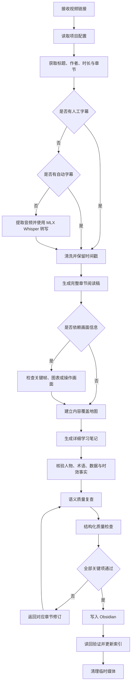

# Summarize Learning Videos

> [!IMPORTANT]
> 本项目只用于学习笔记整理。原视频及相关内容的权利归原作者或合法权利人所有；本项目不通过原视频内容牟利。请在使用前阅读以下完整说明。

## 免责声明与版权说明

### 制作目的

本项目仅用于个人学习、知识整理和复习辅助。它把用户有权访问的视频内容提炼为结构化学习笔记，帮助用户在观看视频后回顾主要观点、方法、案例和知识结构。本项目不以替代原视频、重新发布原视频或提供原视频内容的完整复制品为目的。

### 版权归属

通过本工具处理的 Bilibili、YouTube 或其他来源视频，其视频、音频、字幕、画面、文字、商标以及其他受保护内容的权利，均归原作者或相应合法权利人所有。本项目及笔记生成行为不改变这些权利的归属，也不代表原作者、视频平台或其他权利人对本项目提供了赞助、认可或授权。

生成的学习笔记应尽量保留原视频链接和作者信息，并以概括、提炼和转述为主。用户需要引用、转载、公开发布或以其他方式使用相关内容时，应自行确认已经取得必要授权，并遵守原视频平台规则、适用法律及权利人的要求。

### 非商业性质

本项目作者发布和维护该工具的目的不是通过原视频内容牟利；本项目不销售原视频、视频片段或由视频直接复制而来的内容，也不代表任何视频平台或原作者开展商业活动。

需要特别说明：本仓库采用 MIT 许可证，MIT 许可证只适用于本项目自行编写的软件代码和项目文档，并允许这些软件代码被商业使用。它不适用于第三方视频、字幕、画面、音乐、商标或其他受保护内容，也不向任何人授予商业使用这些第三方内容的权利。任何下游使用者均应自行承担其使用行为产生的版权和合规责任。

### 内容准确性

自动字幕、语音识别和内容提炼可能存在遗漏或错误，学习笔记不能替代原视频。涉及重要结论、专业建议、数据或原作者准确表述时，应回到原视频和可靠的一手资料核对。本项目按 MIT 许可证以“现状”提供，不对输出的完整性、准确性或特定用途适用性作出保证。

## 项目简介

**作者：** [Chen Zhang（@zccyes）](https://github.com/zccyes)<br>
**官方仓库：** <https://github.com/zccyes/summarize-learning-videos>

将 Bilibili、YouTube 等公开视频转换为详细、带时间戳、可复习、可追溯的 Obsidian 学习笔记。

这个 Codex Skill 面向“看完视频后仍希望长期学习和检索”的场景。它不会只生成几段简短摘要，而是尽可能覆盖视频的全部主要章节、论证过程、案例、方法、限制与争议，并在写入知识库前执行强制质量检查。

> 本项目以输出质量为第一优先级。性能优化只能减少重复获取、无意义下载和工具往返，不能通过缩小语音识别模型、跳过章节或取消事实核验来换取速度。

## 主要能力

- 支持 Bilibili、YouTube 及 `yt-dlp` 能访问的其他视频来源。
- 优先使用作者字幕，其次使用平台自动字幕。
- 没有字幕时，自动提取音频并通过 MLX Whisper 在本地转写。
- 保留时间戳和平台官方章节。
- 将碎片字幕整理为完整的章节阅读稿，减少上下文割裂。
- 针对访谈、教程、课程、商业分析、观点视频和案例纪录片调整笔记结构。
- 对 PPT、软件演示、图表、代码和静默画面进行必要的视觉补充检查。
- 区分视频作者观点、已验证事实和总结者推断。
- 对时效性强或不确定的事实优先使用官方来源核验。
- 输出 Obsidian 兼容 Markdown、YAML 属性、知识图谱关键词、已解析双向链接和时间戳链接。
- 为每个核心概念生成只显示百度与 Google Logo 的一键搜索按钮，无需安装 Obsidian 插件。
- 维护视频学习索引。
- 保存前执行语义质量复核和结构化质量门。
- 质量检查失败时自动返工，复检通过后才允许写入 Obsidian。
- 记录字幕获取、音频、转写和整理耗时，方便持续优化。
- 默认清理临时音频、视频和转写中间文件。

## 工作流程



## 输出内容

默认的详细学习笔记包含：

1. 视频基本信息与来源质量。
2. 一句话主题。
3. 能独立理解的内容总览。
4. 带原视频跳转链接的时间轴。
5. 分章节详细提炼。
6. 核心概念与术语，以及百度、Google Logo 搜索按钮。
7. 关键论证、案例和证据。
8. 可复用的方法、流程或分析框架。
9. 作者的假设、限制和可能争议。
10. 可执行清单。
11. 复习问题。
12. 用于关系图谱聚合的规范化关键词标签，以及确实存在的 Obsidian 笔记链接。
13. 提炼质量和不确定性说明。

默认篇幅会根据信息密度和视频长度调整：

| 视频长度 | 建议笔记规模 |
|---|---:|
| 15 分钟以内 | 约 1,500–3,000 个中文字符 |
| 15–45 分钟 | 约 3,000–6,000 个中文字符 |
| 45–90 分钟 | 约 5,000–9,000 个中文字符 |
| 90 分钟以上 | 按章节展开，不设置机械上限 |

这些数字是完整性参考，不是凑字数要求。重复内容会合并，但不同观点、案例、条件和反例不能因为压缩篇幅而丢失。

## 来源质量等级

每篇笔记必须声明来源等级：

| 等级 | 含义 |
|---|---|
| A | 完整作者字幕，并对必要画面完成检查 |
| B | 完整平台自动字幕，完成术语抽查和必要画面检查 |
| C | 完整本地语音识别，明确披露可能的术语和视觉限制 |
| D | 转写不完整、存在重要缺口，或只能取得部分页面信息 |

D 级来源不能声称“完整总结”。如果信息不足以支撑高质量输出，Skill 应明确说明限制，而不是根据标题和简介补写内容。

## 强制质量门

质量检查是正式流程的第三遍处理，不是可选步骤。

### 第一遍：覆盖地图

- 阅读完整章节稿。
- 确认每个主要主题都有对应章节。
- 提取主张、解释、证据、案例、限制和结论。
- 标记需要核验的人物、机构、数据和术语。

### 第二遍：详细综合

- 按视频类型生成详细学习笔记。
- 保留有意义的说话人分歧。
- 区分事实、观点和推断。
- 将真实流程整理为可执行步骤。
- 使用简短转述，避免大段复制受版权保护的原文。

### 第三遍：发布前质量检查

- 将成稿与完整章节稿并排复核。
- 检查是否遗漏主要章节、论证、案例、反例或限定条件。
- 检查人物归属、术语、数字和时效事实。
- 检查时间轴、章节数量、复习问题和质量声明。
- 运行 `scripts/validate_note.py`。
- 任一关键项失败时，返回源章节修订并重新检查。
- 通过后才写入 Obsidian，并读回最终文件确认一致。

结构化检查示例：

```bash
scripts/validate_note.py \
  "/path/to/draft-note.md" \
  --duration-seconds 3541 \
  --expected-chapters 9
```

成功时返回：

```json
{
  "passed": true,
  "errors": [],
  "warnings": []
}
```

结构检查只能发现缺少章节、篇幅异常、占位符、属性和格式问题，不能代替 Codex 对内容正确性和深度的语义检查。

## 系统要求

### 必需

- 支持 Skills 的 Codex 环境。
- Python 3.10 或更高版本。
- [`yt-dlp`](https://github.com/yt-dlp/yt-dlp)：获取元数据、章节、字幕和音频。
- [`FFmpeg`](https://ffmpeg.org/)：提取和处理音频、生成关键帧。

### 无字幕视频

- Apple Silicon Mac。
- [`mlx-whisper`](https://github.com/ml-explore/mlx-examples/tree/main/whisper)。
- 默认模型：`mlx-community/whisper-large-v3-turbo`。

有字幕的视频不依赖 MLX Whisper。当前自动本地转写流程针对 Apple Silicon 优化；Intel Mac、Windows 和 Linux 用户需要自行替换 ASR 后端，或只处理已有字幕的视频。

## 安装

### 1. 下载 Skill

仓库发布后，可以直接执行：

```bash
git clone "https://github.com/zccyes/summarize-learning-videos.git" \
  "${CODEX_HOME:-$HOME/.codex}/skills/summarize-learning-videos"
```

确认存在：

```text
~/.codex/skills/summarize-learning-videos/SKILL.md
```

重新打开 Codex，或开始一个能够重新发现 Skills 的任务。

### 2. 安装系统工具

Apple Silicon Mac 推荐使用仓库内的一键安装脚本：

```bash
cd "${CODEX_HOME:-$HOME/.codex}/skills/summarize-learning-videos"
./scripts/setup_macos.sh
```

这个脚本通过 Homebrew 安装 `yt-dlp`、FFmpeg 和 `uv`，并用 `uv` 安装 MLX Whisper。所用软件均可免费安装，但下载模型会占用一定磁盘空间。

如需手动安装，可执行：

macOS Homebrew：

```bash
brew install yt-dlp ffmpeg
```

安装 `uv` 后，以独立工具方式安装 MLX Whisper：

```bash
uv tool install mlx-whisper
```

验证：

```bash
yt-dlp --version
ffmpeg -version
mlx_whisper --help
```

### 3. 创建项目配置

进入你准备处理视频的工作区，用初始化工具填写 Obsidian 仓库路径：

```bash
python3 \
  "${CODEX_HOME:-$HOME/.codex}/skills/summarize-learning-videos/scripts/init_config.py" \
  --vault "/你的/Obsidian/仓库绝对路径" \
  --target-folder "未分类"
```

工具会先确认该路径确实包含 `.obsidian`，再在当前目录创建 `project-config.yaml`。这个文件可能含有个人路径，已被 `.gitignore` 排除，不应上传 GitHub。

也可以手动复制示例配置：

```bash
cp \
  "${CODEX_HOME:-$HOME/.codex}/skills/summarize-learning-videos/references/project-config.example.yaml" \
  ./project-config.yaml
```

至少修改：

```yaml
output:
  vault_root: "/absolute/path/to/your/ObsidianVault"
  target_folder: "."
```

如果配置文件不在当前工作区，可以设置：

```bash
export VIDEO_NOTES_CONFIG="/absolute/path/to/project-config.yaml"
```

完整配置参考：[references/project-config.example.yaml](references/project-config.example.yaml)。

### 4. 运行环境自检

```bash
python3 \
  "${CODEX_HOME:-$HOME/.codex}/skills/summarize-learning-videos/scripts/doctor.py"
```

只有 `✗` 表示必须修复的问题；`!` 表示当前仍可运行，但某类视频或功能可能受限。

## 基本用法

### 在 Codex 中使用

#### 使用 `SLV` 快捷调用

`SLV` 是 `summarize-learning-videos` 的正式调用别名，不区分字母大小写。只要在视频处理请求中写出独立的 `SLV`、`slv` 或 `Slv`，Codex 就应将其视为明确指定使用本 Skill。

推荐的最简写法：

```text
用 SLV 深度整理并保存：
https://www.bilibili.com/video/BVxxxxxxxxxx/
```

也可以写成：

```text
请用 SLV 帮我阅读这个视频并整理成学习笔记：
https://www.youtube.com/watch?v=xxxxxxxxxxx
```

如果只写了 `SLV` 但没有提供视频链接或本地视频，Codex 应先请求补充视频来源，而不是改用其他总结流程。

#### 使用完整 Skill 名称

直接发送视频链接：

```text
https://www.bilibili.com/video/BVxxxxxxxxxx/
```

或者明确调用 Skill：

```text
使用 $summarize-learning-videos，把这个视频整理成详细中文学习笔记并保存到 Obsidian：
https://www.youtube.com/watch?v=xxxxxxxxxxx
```

可以增加关注方向：

```text
请重点提炼商业模式、关键假设和可执行步骤。
```

```text
这是课程系列的第三期，请保持和前两期相同的笔记结构，并建立双向链接。
```

```text
这是软件教程，必须检查关键界面和操作画面。
```

### 手动运行预处理流水线

通常应由 Codex 自动调用。调试时可以手动运行：

```bash
scripts/run_pipeline.py \
  "https://www.bilibili.com/video/BVxxxxxxxxxx/" \
  --output ./work/BVxxxxxxxxxx \
  --language zh
```

流水线会依次完成：

- 元数据和官方章节获取。
- 人工字幕检查。
- 自动字幕检查。
- 没有字幕时下载音频。
- MLX Whisper 转写。
- 时间戳清洗。
- 章节阅读稿生成。
- 阶段耗时记录。

典型中间文件：

```text
work/<video-id>/
├── manifest.json
├── source.<language>.vtt   # 有字幕时
├── audio.mp3               # 无字幕时，完成后应清理
├── whisper.json            # 本地转写时
├── transcript.md
├── chapterized.md
└── timings.json
```

## 配置说明

### `output`

- `vault_root`：Obsidian 仓库的绝对路径。
- `target_folder`：主笔记相对于仓库的保存位置，`.` 表示仓库根目录。
- `transcript_folder`：选择保留转写稿时的目录。
- `attachments_folder`：关键帧和附件目录。
- `index_note`：视频总索引名称。

### `defaults`

- `detail_level`：推荐保持 `detailed-study`。
- `quality_priority`：推荐保持 `maximum`。
- `preserve_timestamps`：保留可点击时间戳。
- `preserve_original_terms`：中文说明中保留重要英文术语。
- `generate_review_questions`：生成复习问题。
- `inspect_visuals_when_material`：对画面依赖型视频检查关键帧。
- `local_asr.model`：本地转写模型。质量优先时不建议改小。

### `retention`

- `keep_clean_transcript`：是否把完整清洗转写稿保存到知识库。
- `keep_raw_subtitle`：是否长期保留原始字幕。
- `keep_audio`：是否保留音频。默认关闭。
- `keep_full_video`：是否保留完整视频。默认关闭。

### `safety`

- `overwrite_existing_notes`：默认禁止覆盖同名笔记。
- `bypass_access_controls`：必须保持 `false`。

### `performance`

性能选项只能减少流程浪费：

- 单次获取并自动降级，避免重复读取元数据。
- 把完整字幕合并为一次章节阅读材料。
- 记录真实阶段耗时。
- 不允许自动换成小模型。
- 不允许跳过事实核验。

### `quality_gate`

建议所有字段保持启用：

- 强制与完整章节稿对照。
- 强制语义复查。
- 强制结构检查。
- 失败后自动返工。
- 强制写入后的读回验证。

## 视频类型适配

### 访谈或播客

- 按问题和主题组织。
- 保留不同嘉宾的观点和分歧。
- 区分个人经历、预测和事实。
- 语言主导时不机械下载完整画面。

### 教程或软件演示

- 按前置条件、操作步骤、参数、结果和错误处理组织。
- 必须检查关键界面、代码和视觉结果。
- 输出可复现的操作清单。

### 课程或讲座

- 按学习目标、定义、原理、推导、例题和练习组织。
- 说明章节之间的依赖关系。

### 商业或市场分析

- 按背景、问题、证据、假设、判断、策略和风险组织。
- 保留数据日期。
- 明确区分观察与预测。

### 观点评论

- 按主张、前提、论据、反例、边界和结论组织。
- 指出缺失证据，但不要擅自替作者补全论证。

## 性能说明

处理时间取决于：

- 是否存在完整字幕。
- 视频长度和语速。
- 本地芯片、内存和温度。
- 是否需要下载和检查画面。
- 需要核验的事实数量。
- 输出深度和返工次数。

有字幕的视频通常明显更快。无字幕视频的主要固定成本是本地转写。Skill 会记录 `timings.json`，应以真实日志定位瓶颈，不承诺固定完成时间。

质量优先模式不会：

- 换用更小的 ASR 模型。
- 跳过视频章节。
- 只根据标题和简介总结。
- 取消事实核验。
- 取消发布前质量检查。
- 为了达成目标耗时而压缩笔记。

## 隐私、安全与版权

- 字幕和音频优先在本地处理。
- 不绕过 DRM、付费墙、私有权限或平台访问限制。
- 只有在公开访问失败且用户授权时，才使用 `--cookies-from-browser chrome`。
- 不要把 Cookies、浏览器配置、登录信息或临时下载目录提交到 GitHub。
- 默认不长期保留完整视频和音频。
- 笔记以结构化转述为主，只在原话本身重要时保留短引用。
- 用户应遵守视频平台条款、当地法律和内容版权要求。
- 财经、医疗、法律等视频的总结不构成专业建议；应保留原作者的免责声明和不确定性。

建议 `.gitignore` 至少包含：

```gitignore
.work/
work/
*.mp3
*.m4a
*.mp4
*.webm
*.wav
whisper.json
transcript.md
chapterized.md
timings.json
.DS_Store
__pycache__/
*.pyc
```

## 已知限制

- Bilibili 或 YouTube 可能修改接口，需及时升级 `yt-dlp`。
- 部分视频需要登录或地区权限；Skill 不会绕过访问控制。
- 本地 ASR 仍可能误识别人名、数字、缩写和专业术语。
- 多人同时说话时，说话人归属可能不可靠。
- 纯音频无法覆盖 PPT、图表、代码或屏幕操作中的独有信息。
- 没有官方章节的视频只能先按时间创建阅读段落，再由 Codex 按主题重新划分。
- 当前无字幕转写后端针对 Apple Silicon 的 MLX Whisper；其他平台需要适配新的 ASR 后端。
- 自动结构检查不能判断复杂观点是否准确，必须保留语义复核。

## 常见问题

### 为什么不用更小的 Whisper 模型加速？

这个 Skill 的默认目标是高质量长期学习笔记。较小模型更容易在人名、数字和专业术语上出错，因此默认保持 `large-v3-turbo`。如果用户主动接受质量折中，可以自行修改配置，但不建议作为仓库默认值。

### 一定会下载完整视频吗？

不会。有字幕时只获取字幕和元数据；没有字幕时优先只下载音频。只有画面对理解有实质影响时，才获取必要的视频画面。

### 为什么不能只读取视频简介？

简介不能证明视频的完整论证、案例、反例和限定条件。无法取得字幕或音频时，Skill 必须降低来源等级并说明覆盖不足。

### 为什么输出前还要再检查一次？

长视频容易在压缩时遗漏中间论证或说话人分歧。质量门会重新对照完整章节稿，并在遗漏、归属错误或结构不完整时自动返工。

### 可以不使用 Obsidian 吗？

可以。输出本质上是 Markdown。修改 `project-config.yaml` 的输出路径即可保存到普通目录，但自动双向链接和附件组织是按 Obsidian 设计的。

### 可以批量处理播放列表吗？

当前 Skill 默认一次处理一个视频，以便保证逐篇质量。批量队列可以在外层调度，但每个视频仍应独立通过质量门。

## 目录结构

```text
summarize-learning-videos/
├── .github/
│   └── workflows/
│       └── ci.yml
├── .gitignore
├── CONTRIBUTING.md
├── LICENSE
├── README.md
├── SKILL.md
├── agents/
│   └── openai.yaml
├── references/
│   ├── project-config.example.yaml
│   ├── quality-checklist.md
│   ├── summary-template.md
│   └── video-type-guides.md
├── scripts/
│   ├── chapterize_transcript.py
│   ├── doctor.py
│   ├── init_config.py
│   ├── normalize_transcript.py
│   ├── prepare_video.py
│   ├── run_pipeline.py
│   ├── setup_macos.sh
│   └── validate_note.py
└── tests/
    ├── test_repository.py
    └── test_workflow.py
```

## 脚本说明

| 脚本 | 用途 |
|---|---|
| `run_pipeline.py` | 推荐入口；执行获取、字幕降级、转写、清洗、章节化和计时 |
| `prepare_video.py` | 单独获取元数据、字幕或音频，主要用于调试和恢复 |
| `normalize_transcript.py` | 将 VTT 或 Whisper JSON 转为带时间戳的 Markdown |
| `chapterize_transcript.py` | 按官方章节组织完整转写内容 |
| `validate_note.py` | 检查发布前笔记的属性、章节、篇幅、时间轴和占位符 |
| `doctor.py` | 检查 Python、外部工具、Skill 文件、项目配置和 Obsidian 输出路径 |
| `init_config.py` | 验证 Obsidian 仓库并生成不会被提交的本地配置 |
| `setup_macos.sh` | 在 Apple Silicon Mac 上安装免费依赖并完成首次环境检查 |

## 开发与验证

检查 Python 语法：

```bash
python3 -m py_compile scripts/*.py tests/*.py
python3 -m unittest discover -s tests -v
bash -n scripts/setup_macos.sh
```

GitHub Actions 会在每次推送和 Pull Request 时自动执行以上语法检查和单元测试。它不下载真实视频，也不消耗转写模型资源。

验证 Skill 结构：

```bash
uv run --with pyyaml \
  python /path/to/skill-creator/scripts/quick_validate.py .
```

建议发布前至少完成：

1. 一个有人工字幕的视频测试。
2. 一个只有自动字幕的视频测试。
3. 一个没有字幕、需要本地转写的视频测试。
4. 一个画面依赖型教程测试。
5. 一个至少 45 分钟的长视频质量回归测试。
6. Obsidian 写入、索引更新和读回测试。
7. 质量门失败后自动修订的测试。

## 上传 GitHub 前检查

- [x] 自动测试会检查已知个人路径；`.gitignore` 排除本地配置和大文件。
- [x] 不提交 `project-config.yaml`，只提交示例配置。
- [x] 不提交 Cookies、Token、浏览器数据或登录信息。
- [x] 不提交下载的视频、音频、完整转写中间文件和模型缓存。
- [x] GitHub Actions 自动运行语法检查和单元测试。
- [x] 已运行 Skill 结构验证。
- [x] 已检查 README 中的安装命令和相对链接。
- [x] 已选择并添加 MIT 开源许可证。
- [x] 写明支持的平台和已知限制。
- [x] 已用隔离的全新 Codex 目录完成一次安装测试。

可以用下面的命令检查常见个人路径：

```bash
rg -n '/Users/|/home/|Mobile Documents|ObsidianVault|cookies|token' .
```

## 贡献建议

欢迎改进：

- 新的视频平台适配。
- 非 Apple Silicon 的 ASR 后端。
- 更可靠的说话人分离。
- 视觉关键帧选择。
- 多语言术语校正。
- 质量门测试样例。
- Obsidian 索引和主题 MOC 生成。

提交改动时，请避免通过降低默认模型、减少内容覆盖或关闭质量检查来获得基准速度提升。性能优化应提供真实阶段耗时，并证明输出质量没有下降。

## 许可证

本项目由 [Chen Zhang（@zccyes）](https://github.com/zccyes) 于 2026 年最初创建，自行编写的软件代码和项目文档采用 [MIT License](LICENSE)。该许可证不适用于通过本工具访问、分析或提炼的任何第三方视频及相关内容；相关权利仍归原作者或相应合法权利人所有。详见“免责声明与版权说明”。
